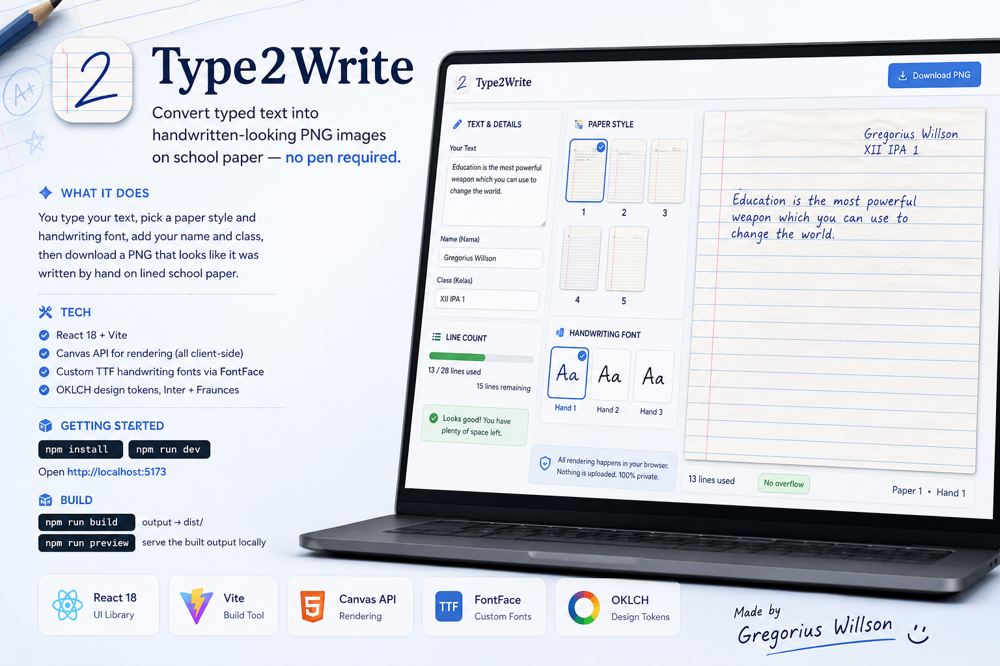
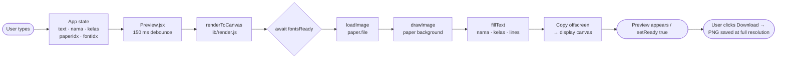
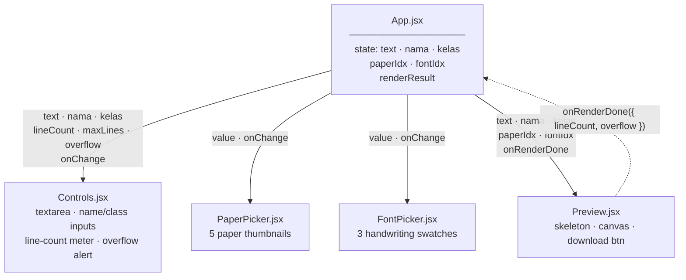
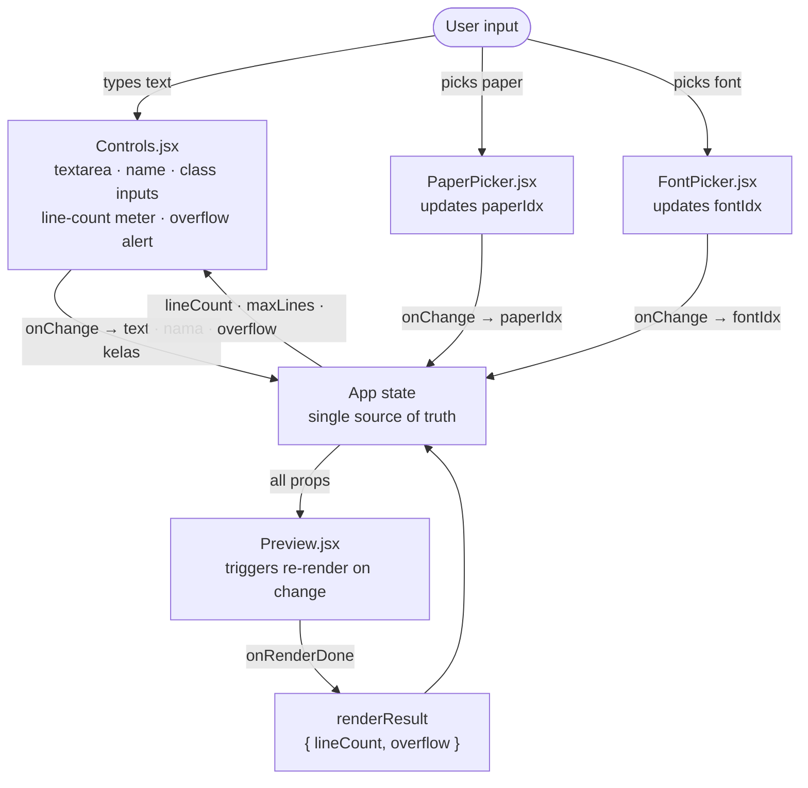
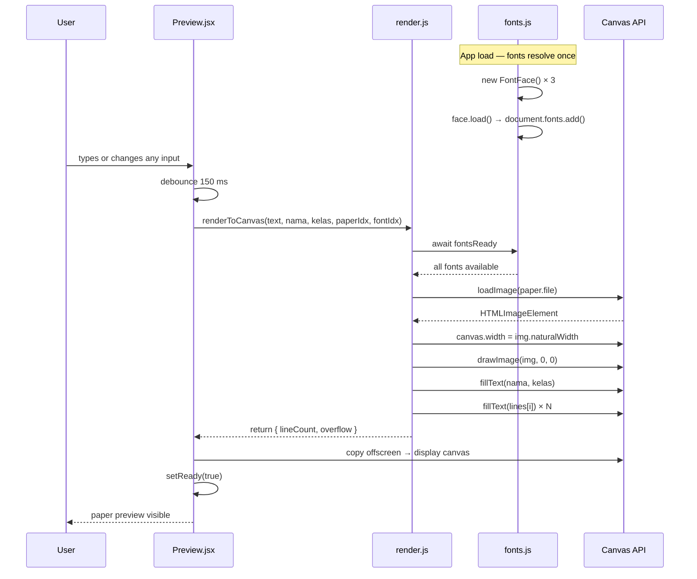

# TypeToWrite



Convert typed text into handwritten-looking PNG images on school paper — no pen required.

## What it does

You type your text, pick a paper style and handwriting font, add your name and class, then download a PNG that looks like it was written by hand on lined school paper.

## Tech

- React 18 + Vite
- Canvas API for rendering (no server, all client-side)
- Custom TTF handwriting fonts loaded via `FontFace`
- OKLCH design tokens, Inter + Fraunces

## Getting started

```bash
npm install
npm run dev
```

Open `http://localhost:5173`.

## Build

```bash
npm run build    # output → dist/
npm run preview  # serve the built output locally
```

## Project structure

```
src/
  App.jsx                  # shell layout, shared state
  index.css                # design tokens + all component styles
  components/
    Controls.jsx           # text, name, class inputs + line-count meter
    PaperPicker.jsx        # paper background selector
    FontPicker.jsx         # handwriting font selector
    Preview.jsx            # canvas preview, skeleton, download
  lib/
    papers.js              # paper + font config (margins, line spacing, etc.)
    fonts.js               # FontFace loader
    render.js              # canvas rendering logic
public/
  papers/                  # paper background images (paper1–5.jpg)
  fonts/                   # handwriting TTF files (hand1–3.ttf)
```

## Architecture

### Rendering pipeline



### Component tree & props



### State & data flow



### Async rendering sequence

The subtlest part of the codebase — `fontsReady` must resolve before any canvas draw call, and `setReady` gates both the skeleton-to-canvas transition and the download button's enabled state.



## How rendering works

1. `fonts.js` loads each TTF via the `FontFace` API and adds it to `document.fonts`.
2. On every input change (150 ms debounce), `render.js` draws the paper image onto a hidden offscreen canvas, then overlays name, class, and wrapped text using the selected font.
3. The result is copied to the visible display canvas (CSS-scaled to fit the viewport).
4. Download saves the offscreen canvas at full native resolution as a PNG.

## Paper / font configuration

Edit `src/lib/papers.js` to adjust per-paper layout values (line spacing, margins, text start position) or add new papers and fonts.

---

Made by Gregorius Willson
