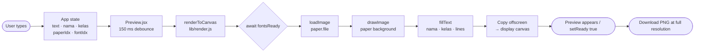
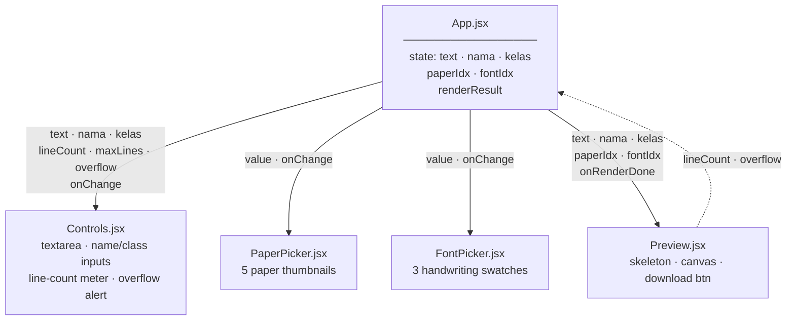
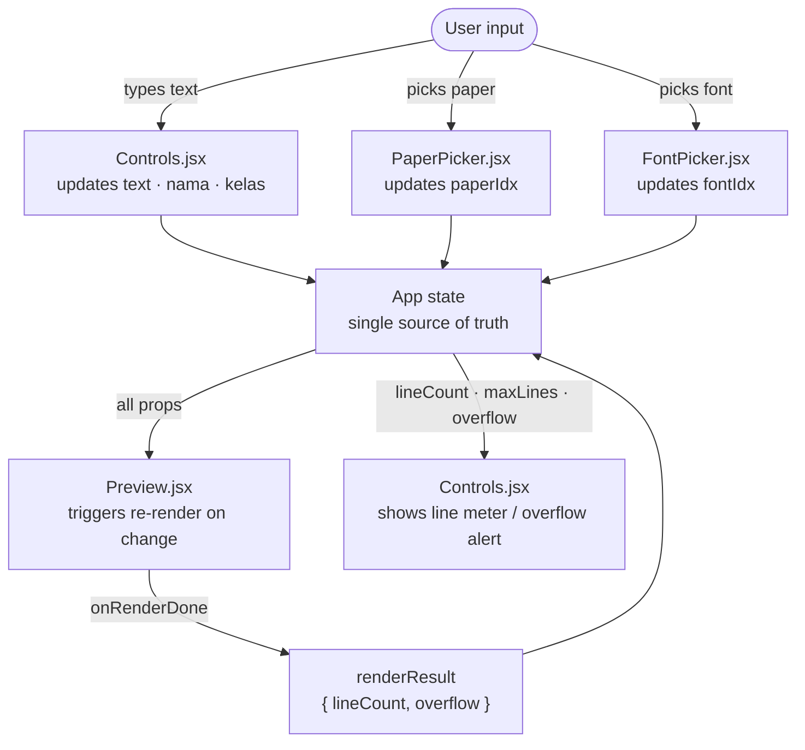
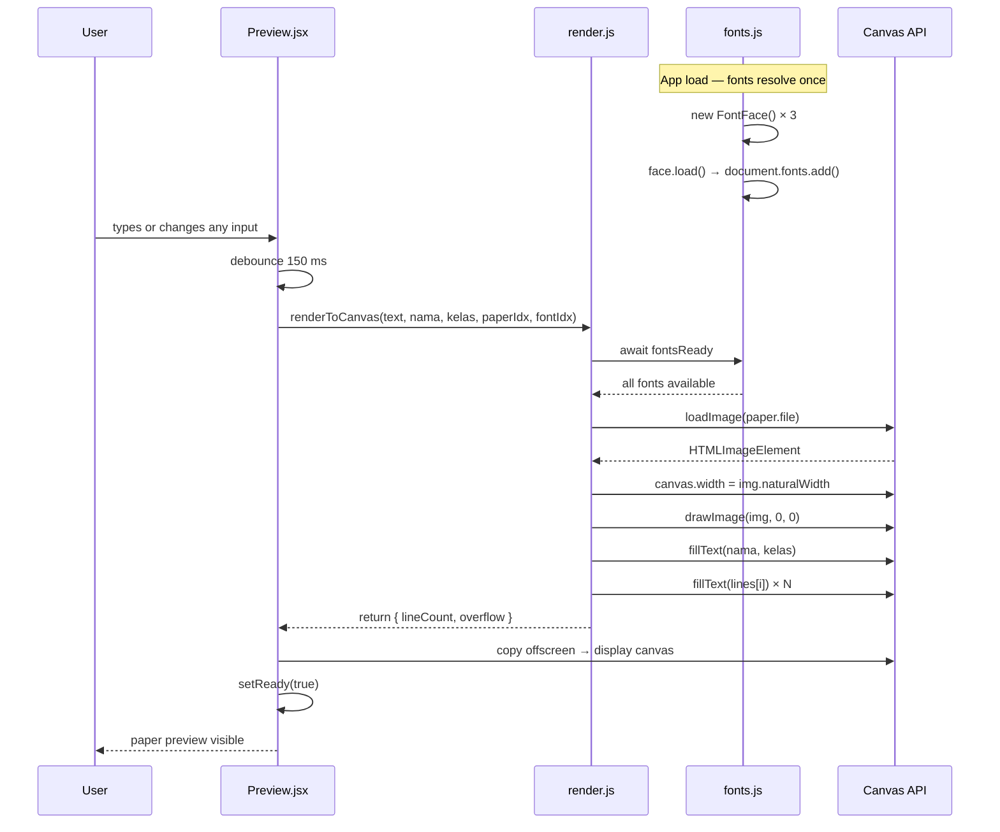

# Mermaid Diagrams Implementation Plan

> **For agentic workers:** REQUIRED SUB-SKILL: Use superpowers:subagent-driven-development (recommended) or superpowers:executing-plans to implement this plan task-by-task. Steps use checkbox (`- [ ]`) syntax for tracking.

**Goal:** Add a `## Architecture` section to `README.md` containing 4 Mermaid diagrams that explain the rendering pipeline, component tree, state flow, and async render sequence for developers.

**Architecture:** One new Markdown section inserted between `## Project structure` and `## How rendering works` in `README.md`. No new files, no code changes — documentation only. GitHub renders `mermaid` fenced code blocks natively.

**Tech Stack:** Mermaid diagram syntax, GitHub Markdown

---

### Task 1: Insert the full Architecture section

**Files:**
- Modify: `README.md`

- [ ] **Step 1: Open `README.md` and confirm the insertion point**

Run:
```bash
grep -n "^## How rendering works" README.md
```
Expected: one line like `44:## How rendering works`. Note the line number.

- [ ] **Step 2: Insert the Architecture section**

Using the Edit tool, find this exact string in `README.md`:

```
## How rendering works
```

And replace it with the full block below (keep `## How rendering works` at the end — it stays in the file):

````markdown
## Architecture

### Rendering pipeline



### Component tree & props



### State & data flow



### Async rendering sequence

The subtlest part of the codebase — `fontsReady` must resolve before any canvas draw call, and `setReady` gates both the skeleton-to-canvas transition and the download button's enabled state.



## How rendering works
````

---

### Task 2: Verify structure and commit

**Files:**
- Modify: `README.md` (read-only verification)

- [ ] **Step 1: Verify all 4 diagram sections are present**

```bash
grep -n "^### Rendering\|^### Component\|^### State\|^### Async" README.md
```

Expected output (4 lines in this order):
```
XX:### Rendering pipeline
XX:### Component tree & props
XX:### State & data flow
XX:### Async rendering sequence
```

- [ ] **Step 2: Verify overall README heading structure is correct**

```bash
grep -n "^## " README.md
```

Expected output:
```
X:## What it does
X:## Tech
X:## Getting started
X:## Build
X:## Project structure
X:## Architecture
X:## How rendering works
X:## Paper / font configuration
```

- [ ] **Step 3: Commit**

```bash
git add README.md
git commit -m "docs: add Architecture section with 4 Mermaid diagrams"
```
